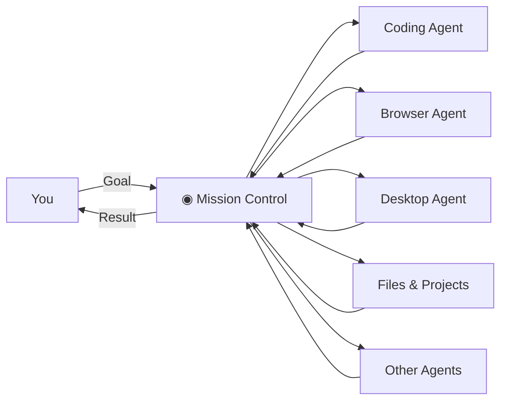
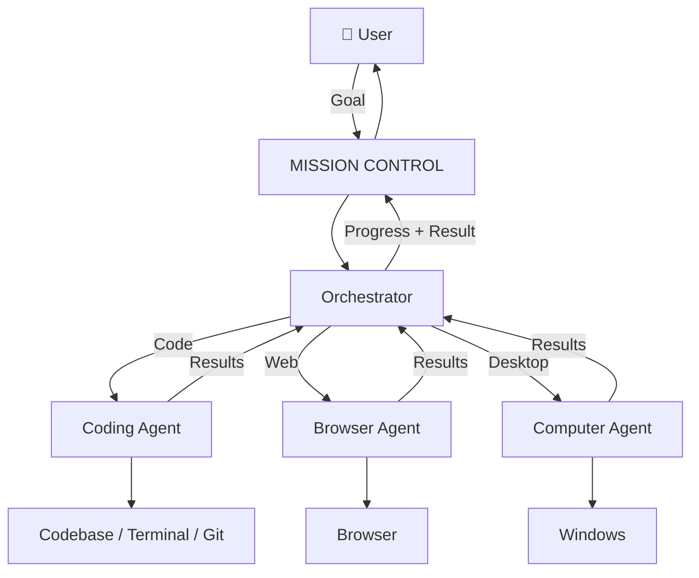
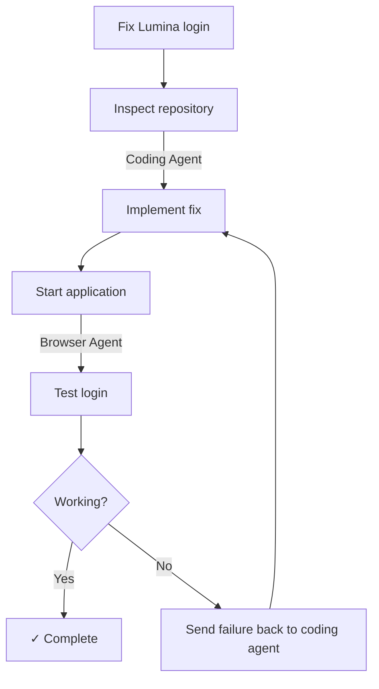

# Mission Control — Vision

The vision for **Mission Control** is much bigger than building another AI chatbot or a prettier interface for Claude Code.

> **Mission Control is a native AI layer for your computer — a place where you give AI agents goals, and those agents can actually work across your development environment, browser, files, and desktop while you remain in control.**

### The problem

AI coding tools are powerful, but they're still fragmented.

Claude Code can work inside a repository. A browser agent can interact with websites. Computer-use agents can interact with desktop applications. Other agents can research, test, write, or automate tasks.

But **you are currently the orchestrator**.

You move information between them, open terminals, provide files, check what they're doing, approve actions, launch applications, and connect one tool's output to another.

Mission Control moves that orchestration into the application.



Instead of telling individual tools what to do, **you tell Mission Control what you want accomplished.**

---

## What Mission Control feels like

The application lives quietly on your desktop as a small floating object — the pill/island concept we liked from Coucou.

Most of the time:

```text
                ╭──────────╮
                │   ◉  ◉   │
                ╰──────────╯
```

It's not another huge application window you have to keep open.

You interact with it naturally.

Click it and it expands.

Drag a file onto it.

Drag a project folder onto it.

Use a global shortcut.

Eventually, speak to it.

For example, you drag your project folder onto Mission Control:

```text
📁 Lumina
    │
    │ drag
    ▼

╭─────────────────────────────╮
│ ◉  Lumina                   │
│                             │
│ What do you want to do?     │
│                             │
│ >                           │
╰─────────────────────────────╯
```

And say:

> Fix the authentication issue and make sure login works.

That's where the important part starts.

---

# Mission Control isn't the agent

This is probably the most important part of the vision.

Mission Control itself shouldn't become one giant AI model with unlimited access to your computer.

It is an **agent runtime and orchestrator**.



Each agent specializes in something.

A **coding agent** understands code.

A **browser agent** understands webpages.

A **computer agent** understands desktop applications.

Mission Control understands **the overall goal**.

---

# A real example

Imagine you're working on Lumina and say:

> **"The login page isn't working. Find the problem, fix it and verify that it works."**

You shouldn't have to explain every step.

Mission Control could construct something like:



The coding agent discovers the bug and changes the code.

Mission Control sees that the application needs testing and launches the browser agent.

The browser agent opens the application and attempts login.

If it fails, the failure goes back to the coding agent.

The coding agent fixes it.

The browser agent tests again.

Eventually:

```text
╭──────────────────────────────────╮
│ ✓ Login issue fixed              │
│                                  │
│ Claude                            │
│ ✓ Fixed session handling         │
│ ✓ Updated auth middleware        │
│                                  │
│ Browser                           │
│ ✓ Login successful               │
│ ✓ Dashboard loaded               │
│                                  │
│ 4 files changed                  │
│ 12 tests passed                  │
╰──────────────────────────────────╯
```

You gave **one goal**, not fifteen instructions.

That's the experience we're trying to build.

---

# The desktop is part of the interface

This is another part that makes the project different.

Mission Control shouldn't treat Windows as something outside the application.

**Your desktop becomes part of the interaction model.**

You could drag:

```text
📄 PDF
🖼️ Screenshot
📁 Project
📄 Source file
📊 CSV
```

onto Mission Control.

And eventually drag things **out**.

For example:

```text
Mission Control

╭────────────────────────╮
│ ✓ Analysis complete    │
│                        │
│ 📄 analysis.pdf        │──────┐
╰────────────────────────╯      │
                                │ drag
                                ▼
                         Windows Desktop

                         📄 analysis.pdf
```

That makes AI feel less like visiting a chatbot and more like interacting with another capability of the operating system.

---

# The visual personality has a purpose

The Coucou-like animations aren't just decoration.

They communicate **agent state without forcing you to read logs**.

Idle:

```text
◉  ◉
```

Thinking:

```text
◉  …  ◉
```

Coding:

```text
◉  </>  ◉
```

Needs you:

```text
◉  !  ◉
```

Done:

```text
◉  ✓  ◉
```

And when expanded:

```text
╭──────────────────────────────────╮
│ Mission Control                  │
│                                  │
│ ● Claude                         │
│   Editing auth/session.rs        │
│                                  │
│ ● Browser                        │
│   Waiting                        │
│                                  │
│ ○ Computer                       │
│   Idle                           │
╰──────────────────────────────────╯
```

You can glance at the pill and understand what's happening.

---

# But the human stays in control

Giving agents access to a computer becomes dangerous if permissions aren't designed properly.

So another central idea is:

> **Autonomy within boundaries.**

Reading project files might happen automatically.

Deleting something might require approval.

Installing software might require approval.

Sending something externally should probably require approval.

For example:

```text
╭──────────────────────────────────────╮
│ ◉ Permission required               │
│                                      │
│ Claude wants to run:                 │
│                                      │
│ npm install @auth/core               │
│                                      │
│ Project: Lumina                      │
│                                      │
│      Deny               Allow        │
╰──────────────────────────────────────╯
```

Mission Control isn't supposed to hide what agents are doing.

It's supposed to make autonomous work **observable and controllable**.

---

# Local-first is part of the vision

The architecture also deliberately differs from a typical SaaS application.

Instead of:

```text
Desktop
   │
Internet
   │
Our Server
   │
Database
   │
Worker
```

we're building:

```text
YOUR COMPUTER

Mission Control UI
        │
        ▼
Mission Control Rust Runtime
        │
   ┌────┼─────┐
   ▼    ▼     ▼
Claude Browser Desktop
   │    │     │
   └────┼─────┘
        ▼
Your Computer
```

Your projects already exist locally.

Claude Code already operates locally.

Windows is local.

The terminal is local.

Git is local.

Therefore the **Mission Control runtime should primarily live locally too**.

Cloud services can be added where they're genuinely useful rather than making the entire system depend on a server.

---

# Where this eventually goes

The first version might simply be:

```text
Pill
 ↓
Mission Control
 ↓
Claude Code
```

But that's only proving the architecture.

Then:

```text
             Mission Control
                   │
          ┌────────┼────────┐
          ▼        ▼        ▼
       Claude   Browser   Desktop
```

Then eventually:

```text
                     MISSION CONTROL
                            │
          ┌─────────────────┼─────────────────┐
          │                 │                 │
       Projects           Agents         Automations
          │                 │                 │
      ┌───┼───┐       ┌────┼────┐       ┌────┼────┐
      ▼   ▼   ▼       ▼    ▼    ▼       ▼    ▼    ▼
    Code Files Git   Code  Web Desktop  Tasks Jobs Events
```

At that point Mission Control becomes closer to a **local operating environment for AI agents**.

And because we aren't coupling the architecture directly to Claude, Claude Code can simply be the first implementation of:

```text
CodingAgent
```

Later another coding agent could sit beside it.

---

## The product in one sentence

If someone asked me what we're building, I'd describe it as:

> **Mission Control is a local-first desktop AI agent platform that lets you give your computer goals instead of individual commands, coordinating specialized coding, browser, and desktop agents to complete work while giving you a simple, visual way to observe and control what they're doing.**

And the floating pill is what makes all of that complexity feel simple.

**That's the north star I'd use while we build it.** Every feature should move us closer to *goal → orchestration → agents → observable work → result*, rather than slowly turning Mission Control into another chat application.
